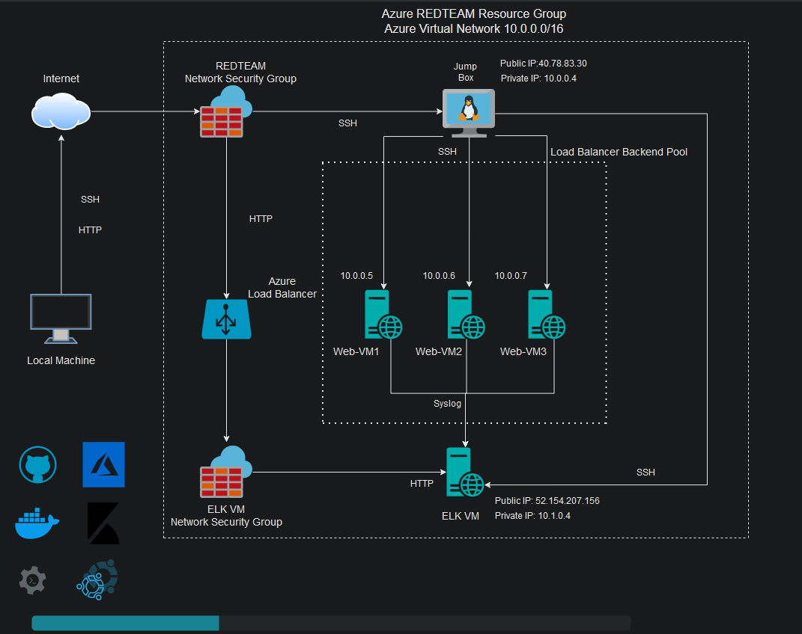

## Automated ELK Stack Deployment

The files in this repository were used to configure the network depicted below.

These files have been tested and used to generate a live ELK deployment on Azure. They can be used to either recreate the entire deployment pictured above. Alternatively, select portions of the included yaml files may be used to install only certain pieces of it, such as Filebeat.

  - configuration.yml
  - filebeat-playbook.yml
  - metricbeat-playbook.yml
  - install_elk.yml

This document contains the following details:
- Description of the Topology
- Access Policies
- ELK Configuration
  - Beats in Use
  - Machines Being Monitored
- How to Use the Ansible Build

### Description of the Topology

The main purpose of this network is to expose a load-balanced and monitored instance of DVWA, the D*mn Vulnerable Web Application.

Load balancing ensures that the application will be highly redundant, in addition to restricting access to the network.

Integrating an ELK server allows users to easily monitor the vulnerable VMs for changes to the logs and system metrics.

- Filebeat monitors log files for locations that can be specified by a system administrator. Filebeat can then be used to forward and aggregate all relatable data to a centralized location 

- Metricbeat can be utilized to record metrics and statistics in respect to each service being run on various systems. Similarly, Metricbeat will send all data to a centralized location for ease of monitoring.   

- Integrating an ELK server allows users to easily monitor the vulnerable VMs for changes to the logs and system metrics.

The configuration details of each machine may be found below.

| Name      | Function    | IP Address     | Operating System |
| Host OS   | Workstation | 73.151.102.152 | Windows 10       |
| Jump-Box  | Gateway     | 10.0.0.4     | Linux            |
| ELK-VM    | Elk Stack   | 10.1.0.4     | Linux            |
| Web-VM1   | DVWA Server | 10.0.0.5     | Linux            |
| Web-VM2   | DVWA Server | 10.0.0.6     | Linux            |
| Web-VM3   | DVWA Server | 10.0.0.7     | Linux            |

### Access Policies

The machines on the internal network are not exposed to the public Internet. 

Only the Jump Box machine can accept connections from the Internet. Access to this machine is only allowed from the following IP addresses:

- 73.151.102.152

Machines within the network can only be accessed by the Jump Box. 

*** ELK-VM also accepts public connections but only from 73.151.102.152

A summary of the access policies in place can be found in the table below.

| Name     | Publicly Accessible | Allowed IP Addresses      |
|----------|---------------------|----------------------     |
| Jump Box | Yes                 | 73.151.102.152            |
| ELK-VM   | Yes                 | 73.151.102.152 & 10.0.0.4 |
| Web-VM1  | No                  | 10.0.0.4                  |
| Web-VM2  | No                  | 10.0.0.5                  |
| Web-VM3  | No                  | 10.0.0.6                  |

### Elk Configuration

Ansible was used to automate configuration of the ELK machine. No configuration was performed manually, which is advantageous because automation allows for the quick configuration of multiple containers. This allows both rapid elasticity as well as scalability. 

The playbook implements the following tasks:

   - Configure elk with Docker
   - Increase virtual memory
   - Use more memory
   - Install Docker.io
   - Install Python3-pip
   - Install Python Docker Module
   - Download and launch a Docker Web Container

The following screenshot displays the result of running `docker ps` after successfully configuring the ELK instance.

### Target Machines & Beats
This ELK server is configured to monitor the following machines:
- _TODO: List the IP addresses of the machines you are monitoring_

We have installed the following Beats on these machines:

- Filebeat
- Metricbeat

These Beats allow us to collect the following information from each machine:

- Filebeat allows you to monitor and collect log files or location, you can find graphs depicting the traffic to your server, the amount of unique connections, and the type of errors received by these connections. As well as the source IP, geolocation, and url they accessed it from.

- Metricbeat allows you to collect and analyze the metrics of your applications. Metricbeat will show Inbound and Outbound traffic, Memory usage, Disk usage, CPU usage, In and Out packet loss, and many other metrics.

### Using the Playbook

In order to use the playbook, you will need to have an Ansible control node already configured. Assuming you have such a control node provisioned: 

SSH into the control node and follow the steps below:

- Copy the install_elk.yml, filebeat-playbook.yml, and metric-playbook.yml files to /etc/ansible.

- Update the etc/ansible/hosts file to include the local IP and the group name as well as the python interpreter. To specify the machine you want to Install the playbook on you need to add the group name that you entered into the hosts file into the playbook YAML file (ex. "hosts: websevers or hosts: elk")

- Run the playbook, and navigate to http://[Your.VM.Public.IP]:5601/app/kibana check that the installation worked as expected.

** In order to run these playbooks effectively, ansible should be configured. Below are specific commands needed to run to download the playbooks, update the files, etc. **

To download any of the above yaml files use the curl command as such:

curl https://github.com/npbarnes47/Networking-Project/blob/main/README/Playbooks/configuration.yml

curl https://github.com/npbarnes47/Networking-Project/blob/main/README/Playbooks/install_elk.yml

curl https://github.com/npbarnes47/Networking-Project/blob/main/README/Playbooks/filebeat-playbook.yml

curl https://github.com/npbarnes47/Networking-Project/blob/main/README/Playbooks/metricbeat-playbook.yml

To run any of the yaml files simply use the following command followed by the name of the yaml file as such:

ansible-playbook configuration.yml

ansible-playbook install_elk.yml

ansible-playbook filebeat-playbook.yml

ansible-playbook metricbeat-playbook.yml
